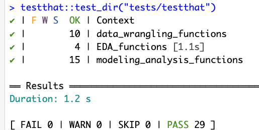

# Titanic survivor prediction by DSCI_522_Group-4

An analytical exploration into the factors influencing survival rates on the RMS Titanic.

## Author

- Sam Fo
- Sampson Yu
- Karan Khubdikar
- Alan Powichrowshi

## About

This report examines the historic Titanic disaster, and focuses on understanding what factors influence passengers survival in case of emergency on a vessel. We employed a statistical analysis on a plethora of parameters, such as age, sec, ticket pricing, and a number of others to determine their impact and relationship on survival likelihood of a passenger. Our report employs logistic regression analysis to understand the relationship between various parameters and survival as mentioned. Unlike predictive models, our focus is on inference, examining how factors like age, gender, class, and cabin location influenced the likelihood of survival - for this reason we only built our model off of one data set without training and testing, as we are looking to only make an inference and understand the relationship between variables. Our findings show us significant disparities, particularly highlighting the better survival chances of women and higher-class passengers - which introduces a socioeconomic factor to survival. The main results observed through our report are as followed:

- Passenger Class: There's a clear negative correlation between passenger class and survival probability. Passengers in lower classes (2nd and 3rd) had significantly lower odds of surviving compared to those in 1st class.
- Gender: Female passengers had a much higher chance of survival than male passengers.
- Age: Age groups also played a critical role. Children had a higher survival rate, while seniors had the lowest.
- Socio-Economic Status: Represented by fare, it had a lesser impact on survival probability.

The analysis, though limited by the historical data available, provides valuable insights into the social and personal dynamics of survival in maritime disasters. This report serves as a preliminary step into understanding what factors effect ones changes of survival in case of a maritime disaster, and can be built on upon with further feature engineering and model types to help move this analysis into the domain of prediction and making steps to reducing fatalities on water vessels. The analysis leverages the *Titanic Passenger Survival Data Set*, which is a compilation of passenger data from RMS Titanic. The analysis will be conducted using R and Python.

## Usage Instructions

### Setup

1. **Install Docker**: Download and install Docker from [Docker's official site](https://www.docker.com/get-started/). After installation, ensure that Docker is running on your computer.

2. **Clone the Repository**: Use Git to clone the project's repository to your local machine.

### Running the Analysis

1. **Start Docker Compose**: Open the command line, navigate to the project's root directory, and run:

    ``` 
    docker compose up
    ```

2. **Access Jupyter Lab**: After running the command, a URL should appear in the terminal. It will look something like `http://127.0.0.1:8888/lab?token=`. Copy and paste this URL into your web browser to access Jupyter Lab. Replace the port number with the one (9000) specified in the `docker-compose.yml` file. The token is a unique identifier that is generated each time you run the Docker container. It is used to authenticate your access to Jupyter Lab.

 

3. **Execute the Notebook and Run the analysis**: Run the following commands in the terminal, make sre you are in the project root.

```
# Processing and Wrangling Data
# Selecting wanted columns from Titanic Data and save to Processed data folder
Rscript scripts/column_selection_script.R "data/Processed/selected_columns.csv"

# Wrangling and Cleaning Data and save to Processed data folder 
Rscript scripts/clean_and_organize_script.R "data/Processed/selected_columns.csv" "data/Processed/clean_wrangled_titanic_data.csv"

# EDA and save image to results section
# Produce EDA plots for financial aspects and personal aspects of passengers
Rscript scripts/EDA_scripts.R --dataset=data/Processed/clean_wrangled_titanic_data.csv --out_dir=results/plots/

# Analysis Modeling
# Produce and fit logistic regression model and save to results model section
Rscript scripts/fit_logistic_model.R 'data/Processed/clean_wrangled_titanic_data.csv' 'Survived' "Pclass + Sex + SibSp + Parch + Fare + AgeGroup" "./results/models"

# Results Summary
# Produce organized table of model outputs and summary and save to results tables section
Rscript ./scripts/generate_result.R --model_file=./results/models/logistic_model.rds --out_dir=./results/models

# build HTML report and copy build to docs folder
jupyter-book build report
cp -r report/_build/html/* docs
```

### Clean Up

1. **Shutdown and Clean Up**: To stop the Docker container, press `Ctrl` + `C` in the terminal where the container is running. Then run:
    
    ```
    docker compose rm
    ```

## Developer Notes

### Adding a New Dependency

1. **Modify Dockerfile**: Add the new dependency to the `Dockerfile`. Create a new branch for these changes. 

2. **Build Docker Image Locally**: Ensure the Docker image builds and runs correctly on your local machine.

3. **Push Changes to GitHub**: After verifying the local build, push your changes to GitHub. This will trigger an automated build and push of the Docker image to Docker Hub, tagged with the commit SHA.

4. **Update Docker Compose File**: On your branch, update `docker-compose.yml` to use the new Docker image version. Be sure to change the image tag accordingly.

5. **Open a Pull Request**: Create a pull request to merge your branch into the `main` branch.


### Running Tests

- **Testing R Functions**: Tests for R functions are implemented using the `testthat` package. To execute these tests, navigate to the project's root directory and run the following command in R or RStudio:
    ```
    testthat::test_dir("tests/testthat")
    ```
If all tests pass, the output should look like this:



## Report

The final report can be found here - [link](https://ubc-mds.github.io/What-Effects-One-Chance-of-Survival-on-the-Titanic-A-Logistic-Regression-Analysis/analysis_titanic_survival.html)

## Dependencies

- `conda` (version 23.7.4 or higher)
- `nb_conda_kernels` (version 2.3.1 or higher)
- R and packages listed in environment.yml

## Licenses

MIT License

## References

- Hendricks, P. (2015). *titanic: Titanic Passenger Survival Data Set*. R package version 0.1.0. Available at: [https://github.com/paulhendricks/titanic](https://github.com/paulhendricks/titanic)
- Space Coast Daily. (2023). *How Many Crew Members Die On Cruise Ships Each Year*. Available at: [https://spacecoastdaily.com/2023/01/how-many-crew-members-die-on-cruise-ships-each-year](https://spacecoastdaily.com/2023/01/how-many-crew-members-die-on-cruise-ships-each-year/#:~:text=On%20the%20other%20hand%2C%20it,on%20cruise%20ships%20every%20year.)
- U.S. News & World Report. (2013). *The 8 Worst Cruise Ship Disasters*. Available at: [https://www.usnews.com/news/articles/2013/02/14/the-eight-worst-cruise-ship-disasters](https://www.usnews.com/news/articles/2013/02/14/the-eight-worst-cruise-ship-disasters)
- R Core Team. (2023). *R: A language and environment for statistical computing*. R Foundation for Statistical Computing, Vienna, Austria. Available at: [https://www.R-project.org/](https://www.R-project.org/)
- Wickham et al. (2023). *Welcome to the tidyverse*. The tidyverse package. Available at: [https://www.tidyverse.org/](https://www.tidyverse.org/)
- Wickham, H. et al. (2023). *dplyr: A Grammar of Data Manipulation*. R package version. Available at: [https://dplyr.tidyverse.org/](https://dplyr.tidyverse.org/)
- Python Software Foundation. (2023). *Python Language Reference, version 3.x*. Available at: [https://www.python.org/](https://www.python.org/)
