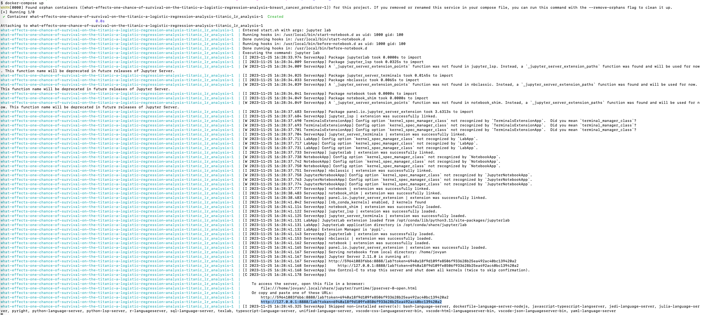

# Titanic survivor prediction by DSCI_522_Group-4

An analytical exploration into the factors influencing survival rates on the RMS Titanic.

## Author

- Sam Fo
- Sampson Yu
- Karan Khubdikar
- Alan Powichrowshi

## About

This project analyzes the Titanic passenger data, we delve into the factors that influenced passenger survival on this historic voyage. Leveraging advanced data analytics, we explore various elements such as passenger class, age, gender, and embarkation point to unravel patterns and insights that shaped the likelihood of survival.

The analysis leverages the *Titanic Passenger Survival Data Set*, which is a compilation of passenger data from RMS Titanic. The analysis will be conducted using R and Python.

## Usage Instructions

### Setup

1. **Install Docker**: Download and install Docker from [Docker's official site](https://www.docker.com/get-started/). After installation, ensure that Docker is running on your computer.

2. **Clone the Repository**: Use Git to clone the project's repository to your local machine.

### Running the Analysis

1. **Start Docker Compose**: Open the command line, navigate to the project's root directory, and run:

    ``` 
    docker compose up
    ```

2. **Access Jupyter Lab**: After running the command, a URL should appear in the terminal. It will look something like `http://127.0.0.1:8888/lab?token=`. Copy and paste this URL into your web browser to access Jupyter Lab.

 

3. **Execute the Notebook**: In Jupyter Lab, open `src/analysis_titanic_survival.ipynb`. Then, go to the "Kernel" menu, select "Restart Kernel and Run All Cells...".

### Clean Up

1. **Shutdown and Clean Up**: To stop the Docker container, press `Ctrl` + `C` in the terminal where the container is running. Then run:
    
    ```
    docker compose rm
    ```

## Developer Notes

### Adding a New Dependency

1. **Modify Dockerfile**: Add the new dependency to the `Dockerfile`. Create a new branch for these changes.

2. **Build Docker Image Locally**: Ensure the Docker image builds and runs correctly on your local machine.

3. **Push Changes to GitHub**: After verifying the local build, push your changes to GitHub. This will trigger an automated build and push of the Docker image to Docker Hub, tagged with the commit SHA.

4. **Update Docker Compose File**: On your branch, update `docker-compose.yml` to use the new Docker image version. Be sure to change the image tag accordingly.

5. **Open a Pull Request**: Create a pull request to merge your branch into the `main` branch.


### Running Tests

- **Testing R Functions**: Tests for R functions are implemented using the `testthat` package. To execute these tests, navigate to the project's root directory and run the following command in R or RStudio:
    ```
    testthat::test_dir("tests/testthat")
    ```
If all tests pass, the output should look like this:


## Report

The final report can be found here - [link](https://ubc-mds.github.io/What-Effects-One-Chance-of-Survival-on-the-Titanic-A-Logistic-Regression-Analysis/analysis_titanic_survival.html)

## Dependencies

- `conda` (version 23.7.4 or higher)
- `nb_conda_kernels` (version 2.3.1 or higher)
- R and packages listed in environment.yml

## Licenses

MIT License

## References

- Hendricks, P. (2015). *titanic: Titanic Passenger Survival Data Set*. R package version 0.1.0. Available at: [https://github.com/paulhendricks/titanic](https://github.com/paulhendricks/titanic)
- Space Coast Daily. (2023). *How Many Crew Members Die On Cruise Ships Each Year*. Available at: [https://spacecoastdaily.com/2023/01/how-many-crew-members-die-on-cruise-ships-each-year](https://spacecoastdaily.com/2023/01/how-many-crew-members-die-on-cruise-ships-each-year/#:~:text=On%20the%20other%20hand%2C%20it,on%20cruise%20ships%20every%20year.)
- U.S. News & World Report. (2013). *The 8 Worst Cruise Ship Disasters*. Available at: [https://www.usnews.com/news/articles/2013/02/14/the-eight-worst-cruise-ship-disasters](https://www.usnews.com/news/articles/2013/02/14/the-eight-worst-cruise-ship-disasters)
- R Core Team. (2023). *R: A language and environment for statistical computing*. R Foundation for Statistical Computing, Vienna, Austria. Available at: [https://www.R-project.org/](https://www.R-project.org/)
- Wickham et al. (2023). *Welcome to the tidyverse*. The tidyverse package. Available at: [https://www.tidyverse.org/](https://www.tidyverse.org/)
- Wickham, H. et al. (2023). *dplyr: A Grammar of Data Manipulation*. R package version. Available at: [https://dplyr.tidyverse.org/](https://dplyr.tidyverse.org/)
- Python Software Foundation. (2023). *Python Language Reference, version 3.x*. Available at: [https://www.python.org/](https://www.python.org/)
